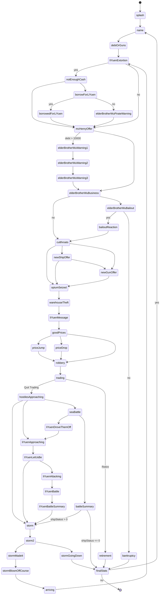

# Taipan!

A from-scratch SwiftUI remake of the [1982 Apple \]\[ trading game by Art Canfil](https://en.wikipedia.org/wiki/Taipan!):

> Taipan! is a 1979 turn-based strategy computer game written for the TRS-80 and ported to the Apple II in 1982. It was created by Art Canfil and the company Mega Micro Computers, and published by Avalanche Productions.
> 
> The game Taipan! was inspired by the novel Tai-Pan by James Clavell. The player is in the role of a trader in the Far East. The goal of the game is for the player to accumulate wealth through trade and possibly also through booty won in battles against pirates.

## Objectives

This is an exercise for me to learn Swift and SwiftUI, open-sourced so that it might help somebody else along the way. I deliberately did not use UIKit for any of the visuals, even when it was probably easier.

I also wanted to explore how easy or difficult it would be to port SwiftUI across iPhone, iPad, and Macs.

I'm a beginner at Swift and SwiftUI, so all feedback are welcome. There's a lot of forced unwrapping in the code, because I bounced back and forth between crashing versus trying to proceed with a nonsensical game state that a prior state should've initialized properly.

## Legal

The strings in the game, and possibly the general game mechanics, almost certainly still remain under copyright protection. Since the original software had long since left the market, I don't believe this harms the commercial interests of the copyright holder.

The formulas are mostly based on the [Cymon's Games version](https://github.com/cymonsgames/CymonsGames/tree/master/taipan) by [Jay Link](jlink@gmail.com) of https://taipangame.com.

The font is [Morris Roman](https://www.1001fonts.com/morris-roman-font.html) used under the [1001Fonts Free For Commercial Use License (FFC)](https://www.1001fonts.com/licenses/ffc.html), specifically:

> 6. Embedding
> the given typeface may be embedded into an application such as a web- or mobile app, independant of the number of the application users, as long as the application does not distribute the given typeface, such as offering it as a download.

I retain the copyright to the source code of this project. You *may not* publish this or a derivative work in the App Store or elsewhere without my permission, but feel free to take snippets or ideas.

## Progress

The iPhone, iPad, and macOS versions are all largely functional and playable.

The iPhone version took about two weeks to build, and is now playable. The landscape iPad version took about a day of tweaking, but the portrait iPad and larger iPhone layouts proved difficult. SwiftUI doesn't make it easy to make small spacing adjustments, especially when we're wrapping everything in a `ScrollView` for accesibility text sizes. The macOS version took another couple of days to bring up, with just ten `#if os()` chunks.

## Features

- The keyboard-oriented Apple \]\[ UI has been adapted for touch input, with a lot less of the nonsensical interactions that can happen in the original, such as opting to fight with no guns
- Light and dark mode support
- Some accessibility support
- Dialogs offer convenient numbers, such as buying enough to fill the ship's hold

## "The Bug"

The touch UI disables options when they're not applicable, which makes "the bug" pretty glaring, and I decided not to mimic it.

## 中文介面

本遊戲以經完全中文化。我翻譯時故意使用一些如「錢莊」等比較古拙的字眼來搭配遊戲中公元 1860 年左右的用詞，但有哪位先進願意指教的話，我是感激不盡。

您如果在 macOS 上使用，請先用系統的 Font Book 程式確認有下載並安裝 STFangSong 仿宋字體。在 iOS 上我搞不懂該如何下載系統字體，所以內崁 cwTeX 的仿宋字型。這個字型有侵權的疑慮，要另用的話，請從[原出處](https://github.com/l10n-tw/cwtex-q-fonts)取得。據我所知，我沒有發表本遊戲的執行檔，應不受 GPL 約束而必須把遊戲本身也改以 GPL 授權。

## Known Issues

- [X] App Icon
- [X] Localization, including proper plurality handling and `fancyFormatted`
- [X] Keyboard support, including for the custom keypad and Apple \]\[ compatibility
- [X] Untested haptics for when ship is hit
- [ ] Feedback and alert sounds
- [ ] Rotating a device between portrait and landscape orientations during a game
- [ ] Buttons should look different while being pressed
- [ ] Should be able to press any key to skip game delays

## Extra Effort

- [ ] Unit tests, maybe even a robot that plays the game
- [ ] Other color schemes, including a nostalgic green on black
- [ ] Particle effects (confetti for retirement, fire for ship battles)
- [ ] Saved game state
- [ ] High scores
- [ ] Improve layout on larger iPhones and portrait-orientation iPad. There's too much space given to the bottom pane, but SwiftUI makes this harder to fix than it sounds, at least for me.

## Screenshots

Adventure awaits, reformatted for portrait-orientation screens, in dark and light mode!

 

Impossible options are disabled, convenient options are offered

 

Explore the seas and lands beyond, and battle pirates to protect your merchandise (and booty!)

 

iPad

## UI State Diagram

The state machine of the game is depicted below. Note that some of the states are "pass through" and do nothing and simply move on to a subsequent state if certain conditions (e.g., random numbers) are not met. There are nicer ways to depict that, but I think keeping this diagram close to what the code actually does is more useful.

